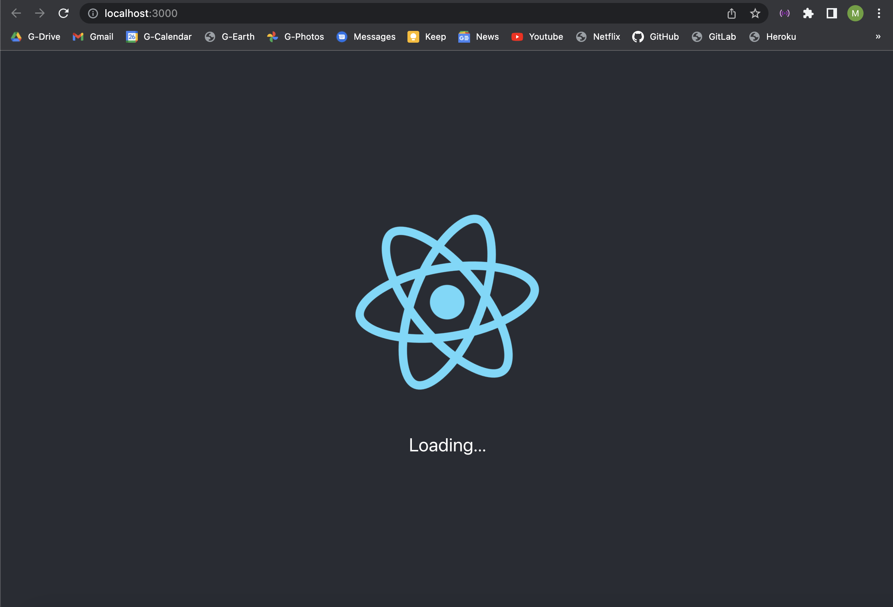
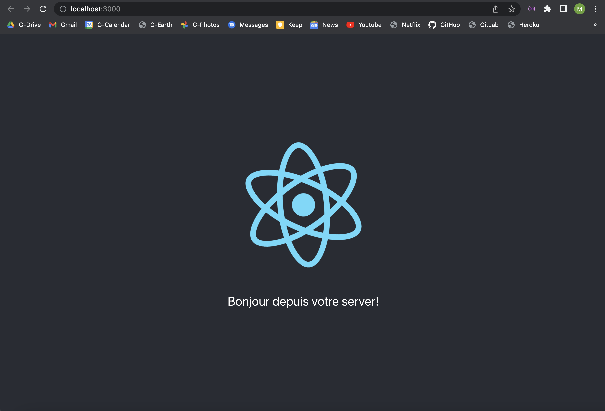

<div id="top"></div>

<!-- PROJECT LOGO -->
<br />
<div align="center">

  <h1 align="center">Minimal Fullstack application</h3>

  <p align="center">
    Meant as study material for P1 Lomé D-CLIC students
  </p>
</div>

<!-- TABLE OF CONTENTS -->
<details>
  <summary>Table of Contents</summary>
  <ol>
    <li>
      <a href="#about-the-project">About The Project</a>
      <ul>
        <li><a href="#built-with">Built With</a></li>
      </ul>
    </li>
    <li>
      <a href="#getting-started">Getting Started</a>
      <ul>
        <li><a href="#database">Database</a></li>
        <li><a href="#server">Server</a></li>
      </ul>
    </li>
    <li><a href="#features">Features</a></li>
    <li><a href="#license">License</a></li>
    <li><a href="#contact">Contact</a></li>
  </ol>
</details>

<!-- ABOUT THE PROJECT -->
## About The Project

Minimal fullstack application built with Node.js and React.js .

### Built With

* [![Node][Node.js]][Node-url]
* [![Express][Express.js]][Express-url]
* [![React][React.js]][React-url]


## Node (Express.js) backend
1. Créez un nouveau dossier pour votre projet et executez les commandes suivantes:

  ```sh
  npm init -y
  npm i express
  ```
2. Créez un dossier appelé "serveur" et un fichier "index.js" dans ce dernier

  ```js
  const path = require("path");
  const express = require("express");
  const app = express();
  const PORT = process.env.PORT || 3001;

  // Have Node serve the files for our built React app
  app.use(express.static(path.resolve(__dirname, "../client/build")));

  // Handle GET requests to /api route (endpoint)
  app.get("/api", (req, res) => {
  res.json({ message: "Bonjour depuis votre server!" });
  });

  // All other GET requests not handled will return our React app
  app.get("*", (req, res) => {
  res.sendFile(path.resolve(__dirname, "../client/build", "index.html"));
  });

  app.listen(PORT, () => {
  console.log(`Server listening on ${PORT}`);
  });
  ```

3. Dans le fichier package.json généré par npm init, ajoutez un script pour executer notre serveur et l'application react.js:

  ```json
  "scripts": {
    "start": "node server/index.js",
    "build": "cd client && npm install && npm run build"
  },
  ```

## React.js frontend
1. Executez la commande ci-dessous à la racine de votre projet pour initialiser une application frontend avec le framework react.js. Le dossier client sera créé en même temps:

  ```sh
  npx create-react-app client
  ```
2. Dans le fichier package.json généré par npx create-react-app, ajoutez une propriété appelée proxy juste après le bloc "scripts". Cela nous permettra de faire des requetes à notre serveur node.js sans avoir à préciser l'adresse (http://localhost:3001) à chaque fois:

```json
"proxy": "http://localhost:3001",
```
3. Pour démarrer votre application react.js, naviguez sur le dossier client et exécutez la commande:
  ```sh
  npm start
  ```
  Si tout se passe bien votre console rendra ce résultat:
  ```sh
  Compiled successfully!

  You can now view client in the browser.

  Local:            http://localhost:3000
  On Your Network:  http://192.168.0.100:3000

  Note that the development build is not optimized.
  To create a production build, use npm run build.

  webpack compiled successfully
  ```
## Faire des requetes HTTP depuis React vers Node

Voyons comment récupérer des données à partir du endpoint "/api" que nous avons créé précédemment.
* Ouvrez le fichier App.js qui se trouve dans client/src et modifiez le code généré par défaut comme suit:

```js
import React from "react";
import logo from "./logo.svg";
import "./App.css";

function App() {
  const [data, setData] = React.useState(null);

  React.useEffect(() => {
    fetch("/api")
      .then((res) => res.json())
      .then((data) => setData(data.message));
  }, []);

  return (
    <div className="App">
      <header className="App-header">
        
        <p>{!data ? "Loading..." : data}</p>
      </header>
    </div>
  );
}

export default App;
```

## Résultats:
* npm start sans avoir démarré le serveur:


* serveur démarré:


<!-- FEATURES -->
## Features

- [x] C3: Développer une interface utilisateur web dynamique
- [x] C6: Développer les composants d’accès aux données
- [x] C7: Développer la partie back-end d’une application web ou web mobile


<!-- LICENSE -->
## License

Distributed under the MIT License.


<!-- CONTACT -->
## Contact

Malick Ba - malick.ba@energy-generation.org

<p align="right">(<a href="#top">back to top</a>)</p>


<!-- MARKDOWN LINKS & IMAGES -->
<!-- https://www.markdownguide.org/basic-syntax/#reference-style-links -->
[Express.js]: https://img.shields.io/badge/Express-20232A?style=for-the-badge&logo=express&logoColor=61DAFB
[Express-url]: https://expressjs.com
[Node.js]: https://img.shields.io/badge/Node.js-35495E?style=for-the-badge&logo=nodedotjs&logoColor=4FC08D
[Node-url]: https://nodejs.org/en/
[React.js]: https://img.shields.io/badge/React.js-000000?style=for-the-badge&logo=react&logoColor=white
[React-url]: https://reactjs.org/
